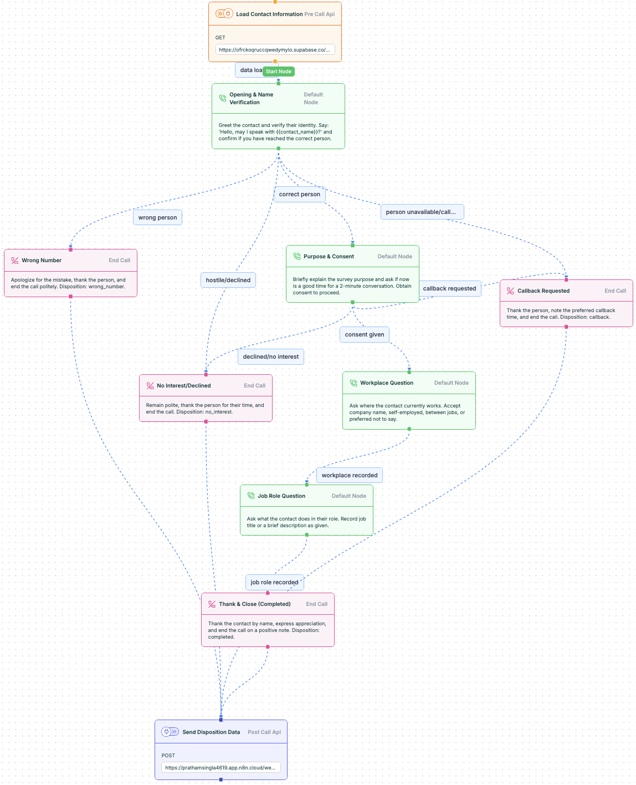
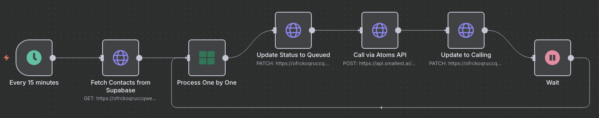
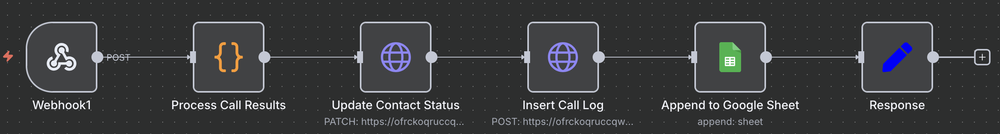

# Voice Agent Auto-Dialer System

##  Project Overview

This project implements an automated voice calling system that connects multiple platforms to create an intelligent phone survey solution. The system automatically calls contacts from a database, conducts brief professional surveys using an AI voice agent, and logs all results for analysis.

### How It Works:
1. **Contact Loading**: The system fetches phone numbers from a Supabase database
2. **Intelligent Calling**: An AI voice agent (powered by Atoms platform) makes the calls and conducts natural conversations
3. **Smart Conversations**: The agent verifies the contact's identity, asks permission, and conducts a 2-minute professional survey
4. **Data Collection**: Responses about workplace and job role are captured automatically
5. **Result Logging**: All call outcomes are saved to both Supabase and Google Sheets for easy analysis
6. **Automatic Retry**: Failed calls are retried intelligently with proper time gaps

The entire system runs on n8n (workflow automation platform) which orchestrates all these components seamlessly.

## 🏗️ Repository Structure

```
voice-agent-autodialer/
├── workflows/                     
│   ├── Voice Agent Main flow.json  
│   ├── Voice Agent Webhook Handler.json 
│   ├── Call Metrics Dashboard Generator.json 
│   └── Retry Failed Calls Handler.json 
│
├── voice-agent/                    
│   └── voice_pathway.json        
│
├── assets/                        
│   ├── voice-agent-flow.png      
│   ├── n8n-main-workflow.png     
│   └── webhook-handler-flow.png 
│
├── .env.example                  
└── README.md                      # This file
```

## 📋 File Descriptions

### Core Workflow Files

#### 1. **Voice Agent Main flow.json**
- Runs every 5 minutes and fetches contacts from Supabase
- Updates their status to "queued"
- Initiates calls through Atoms API
- Tracks call attempts

#### 2. **Voice Agent Webhook Handler.json**
Processes call completion events:
- Receives disposition data from voice agent
- Updates contact status in Supabase
- Logs complete call details
- Appends results to Google Sheets
- Determines if retry is needed

#### 3. **Call Metrics Dashboard Generator.json**
Creates analytics reports:
- Daily call volumes
- Success/failure rates
- Average call durations
- Disposition breakdowns

#### 4. **Retry Failed Calls Handler.json**
Manages intelligent retry logic:
- Identifies stalled or failed calls
- Implements exponential backoff (1hr, 4hrs, 24hrs)
- Resets status for retry

### Voice Agent Configuration

#### **voice_pathway.json** Structure

This file defines the conversation flow for the AI voice agent:

```jsonc
{
  "nodes": [
    {
      "id": "10001",
      "type": "pre_call_api",
      "data": {
        "label": "Load Contact Information",
        "action": "Fetch contact details from database"
      }
    },
    {
      "id": "10002", 
      "type": "default_node",
      "data": {
        "label": "Opening & Name Verification",
        "action": "Greet and verify contact identity"
      }
    },
     // Additional conversation nodes...
    {
      "id": "10010",
      "type": "post_call_api",
      "data": {
        "label": "Send Disposition Data",
        "action": "Send results to n8n webhook"
      }
    }
  ],
  "edges": [
    // Defines connections between conversation nodes
  ]
}
```

**Key Nodes in Voice Pathway:**
1. **Pre-Call API** - Loads contact information before call starts
2. **Opening & Name Verification** - Initial greeting and identity check
3. **Purpose & Consent** - Explains survey and gets permission
4. **Workplace Question** - Asks about current employer
5. **Job Role Question** - Asks about their position
6. **End Call Nodes** - Different endings based on call outcome:
   - Thank & Close (Completed)
   - Wrong Number
   - Callback Requested
   - No Interest/Declined
7. **Post-Call API** - Sends all collected data to webhook

## 💾 Database Schema

### Supabase Tables

#### **contacts_to_call** Table
```sql
CREATE TABLE contacts_to_call (
    id UUID PRIMARY KEY DEFAULT uuid_generate_v4(),
    name TEXT NOT NULL,
    phone TEXT NOT NULL,
    status TEXT DEFAULT 'new',
    attempts INTEGER DEFAULT 0,
    last_attempt_at TIMESTAMP WITH TIME ZONE,
    created_at TIMESTAMP WITH TIME ZONE DEFAULT NOW(),
    metadata JSONB
);
```

**Status Values:**
- `new` - Not yet processed
- `queued` - Selected for calling
- `calling` - Currently being called
- `completed` - Successfully surveyed
- `failed` - Max attempts reached
- `callback` - Requested callback

#### **call_logs** Table
```sql
CREATE TABLE call_logs (
    id UUID PRIMARY KEY DEFAULT uuid_generate_v4(),
    call_id TEXT UNIQUE,
    contact_id UUID REFERENCES contacts_to_call(id),
    name TEXT,
    phone TEXT,
    disposition TEXT,
    summary TEXT,
    next_action TEXT,
    duration_sec INTEGER,
    atoms_call_data JSONB,
    created_at TIMESTAMP WITH TIME ZONE DEFAULT NOW()
);
```

## 📊 Google Sheets Structure

The Google Sheet for call logging should have the following columns:

| timestamp | call_id | contact_id | name | phone | disposition | summary | next_action | duration_sec | atoms_metadata |

## 🖼️ Workflow Visualizations

### Voice Agent Flow

*The conversation pathway showing how the AI agent navigates different scenarios during calls*

### Main n8n Workflow

*The primary orchestration workflow that manages contact fetching, call initiation, and status updates*

### Webhook Handler Flow

*The webhook processor that handles call completions and updates all systems*


## Call Dispositions

| Disposition | Description | Next Action |
|------------|-------------|-------------|
| completed | Survey fully completed | None |
| wrong_number | Reached wrong person | Mark invalid |
| callback | Contact requested callback | Schedule retry |
| no_interest | Declined participation | Do not retry |
| no_answer | No one answered | Retry later |
| busy | Line was busy | Retry later |
| voicemail | Reached voicemail | Retry later |

---
